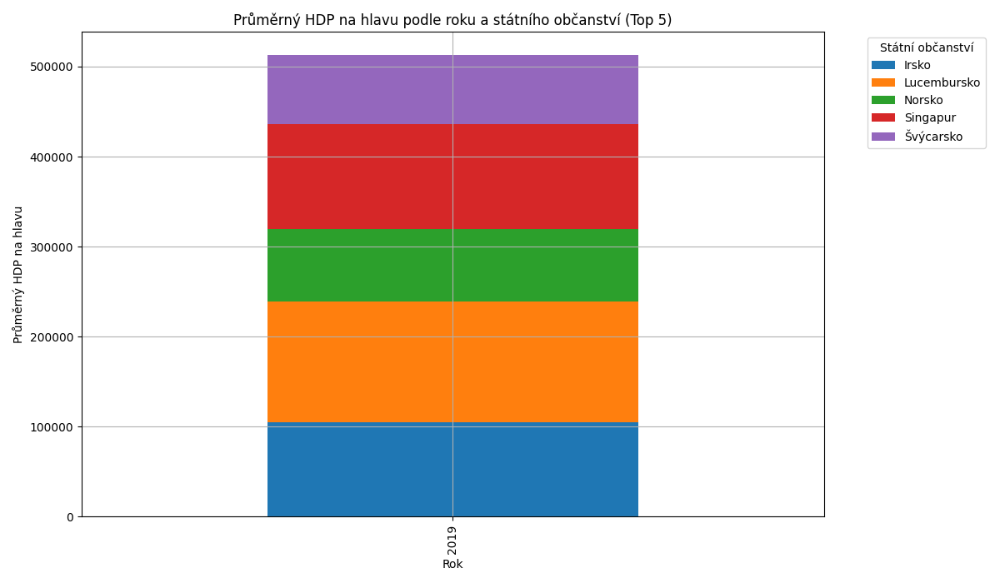

# socioeconomic-data-processing
This project processes and analyzes data about foreigners and GDP from various sources, including CSV files and Wikipedia. The data is stored in MongoDB, and aggregation queries are performed to group and analyze the data by year and citizenship. The results are visualized using bar charts showing the average GDP per capita by year and citizenship.

# Příprava na KI/SZZPP NoSQL

## Úkol

Úkolem bylo propojit a vizualizovat data ze dvou datových zdrojů:
- **Cizinci podle státního občanství, věku a pohlaví – rok 2019**
- **HDP na hlavu pro jednotlivé státy (lze použít i jiný relevantní zdroj)**

## Klíčové fáze řešení

- **Návrh struktury záznamů** pro dokumentově orientovanou databázi (MongoDB)
- **Vytvoření skriptu** pro zpracování externích zdrojů a jejich vložení do databáze (včetně řešení nekonzistencí identifikátorů, chybějících dat apod.)
- **Denormalizace**
- **Návrh a implementace dotazů** (preferovány jsou agregační operace)

### Doporučený výstup
- Seskupení dat podle roků a státního občanství
- Seskupení dat cizinců podle HDP na hlavu v zemích, kde mají státní občanství
- Jednoduchá vizualizace výsledků

## Datové sady

Týkají se nás dvě datové sady:

### 1. **foreigners** (Cizinci podle státního občanství, věku a pohlaví – rok 2019)
Jedná se o data dostupná na webu Českého statistického úřadu ve formátu **OpenData**.

#### Struktura kolekce **foreigners**:

| Atribut      | Popis                                                                 |
|--------------|-----------------------------------------------------------------------|
| **idhod**    | Jedinečný identifikátor záznamu                                       |
| **hodnota**  | Počet cizinců v dané kategorii                                        |
| **rok**      | Rok zjištění (např. 2019)                                             |
| **stobcan_txt** | Státní občanství (např. "Ukrajina")                                 |
| **pohlavi_txt** | Pohlaví (např. "muž", "žena") – může být None                        |
| **vek_txt**  | Věková skupina nebo věk – může být None                              |
| **vuzemi_txt** | Územní celek (např. "Česká republika")                               |
| **kraj_txt** | Kraj (např. "Jihomoravský kraj") – může být None                     |

### 2. **gdp** (HDP na hlavu pro jednotlivé státy)
Data, která byla zpracována pomocí knihovny **pandas** v Pythonu a převedena do zpracovatelného formátu.

#### Struktura kolekce **gdp**:

| Atribut        | Popis                                                |
|----------------|------------------------------------------------------|
| **country**    | Název státu (např. "Ukrajina", "Německo")            |
| **gdp_per_capita** | HDP na obyvatele v USD (číslo)                     |

## Přidávání dat do databáze

Pro přidání dat do databáze jsou použity následující kroky:

1. **Zpracování dat**:
   - Data o cizincích jsou načítána ze souboru CSV a následně vložena do databáze MongoDB.
   - Data o HDP na hlavu jsou načítána z Wikipedie (používáme pandas pro čtení tabulek) a vložena do kolekce **gdp** v MongoDB.

2. **Úprava a čištění dat**:
   - Ošetření chybějících dat a nekonzistencí identifikátorů (např. převod nečíselných hodnot na číselné formáty).
   - Propojení kolekcí **foreigners** a **gdp** pomocí agregačních dotazů v MongoDB.

## Agregační operace

Pro seskupení a analýzu dat jsou použity agregační operace v MongoDB:

- **$lookup**: Spojení dat mezi kolekcemi **foreigners** a **gdp** podle státního občanství.
- **$unwind**: Rozbalení pole záznamů v kolekci **gdp_info**.
- **$group**: Seskupení dat podle roku a státního občanství s výpočtem součtu počtu cizinců a průměrného HDP na hlavu.
- **$sort**: Seřazení výsledků podle roku a průměrného HDP na hlavu.

## Vizualizace

Pro vizualizaci výsledků jsou použity **sloupcové grafy** (stacked bar chart), které zobrazují průměrný HDP na hlavu podle roku a státního občanství.

Tento projekt je součástí přípravy na státnicovou úlohu.
